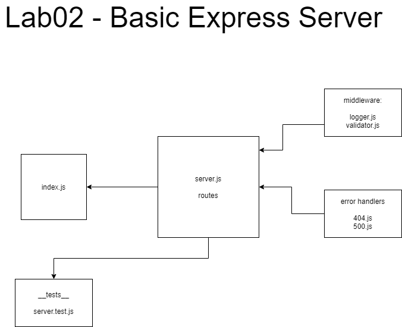

# basic-express-server

## Description

Dynamic API Phase 1: Build your core, standards compliant Express server

## Author

Ayrat Gimranov

## Collaborator

Phil Murphy, Tom, Alex White (instructor)

## Version

1.1.0

## Resources

Code Feloows 401: JS demo code (Class 2) - <https://github.com/codefellows/seattle-javascript-401n19/tree/main/class-02>
Phil Murphy's Lab02 code - <https://github.com/phmurphy212/server-deployment-practice/blob/dev/__test__/server.test.js>

## Deployed Sites

Prod branch -- https://ayrat-server-deploy-prod.herokuapp.com/
Dev branch -- https://ayrat-server-deploy-dev.herokuapp.com/

## UML

;
